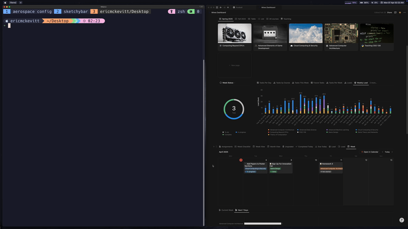
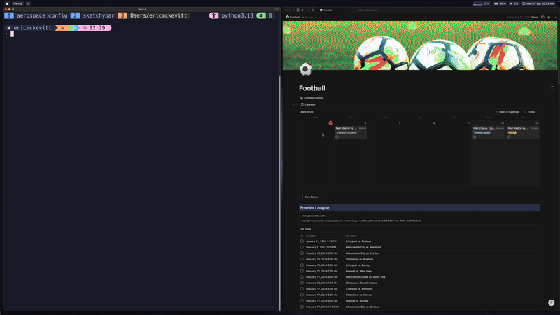

# 📓 Notion Terminal Query Suite

A personalized suite of terminal-based scripts designed to query and display data from my Notion databases. This project showcases how to interact with Notion's API to retrieve and present information in a terminal environment.

## Overview
This suite includes scripts that:
- Query a Notion database containing football match schedules for my favorite teams and display their upcoming matches.
- Retrieve school assignments from a Notion database, filtering by class and due dates, and display them in a structured format.

## Features
- **Interactive Selection:** Utilize `fzf` for fuzzy finding to select databases and specific queries.
- **Dynamic Queries:** Scripts can filter data based on user input, such as selecting a specific football team or academic class.
- **Terminal-Friendly Display:** Data is presented in the terminal using `tabulate` for clear and organized output.
- **Status Highlighting:** Assignment statuses are color-coded for quick identification.

### 🎞️ Demo

See two demos, with the terminal application on the left pane and the corresponding Notion database on the right pane. 

This is a demonstration of the program querying Notion for all assignments due in the current week. 

This second demo is the program querying Notion for football matches filtered by team.

## 🚧 Not a Plug-and-Play Tool

This project is intended as a **personal CLI interface** for querying my own Notion databases — including upcoming football matches and school assignments.

The structure, filters, and queries are built specifically for my Notion setup. While you're welcome to browse the code and draw inspiration, you’ll need to:

- Replace the Notion database IDs with your own
- Customize filters based on your schema
- Modify or extend the FZF menu for your use cases
